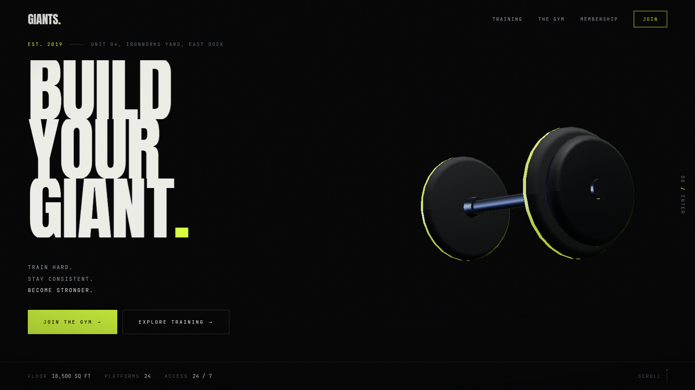

# GIANTS GYM

A cinematic, scroll-driven brand experience for a fictional strength facility.
Built as a portfolio piece: one continuous WebGL scene running the length of the
page, motion physics that communicate mass, and an editorial art direction that
is deliberately not a gym template.



---

## Run it

```bash
npm install
npm run dev          # http://localhost:3000
npm run build && npm start
npm run lint
```

Useful query parameters while developing:

| Parameter   | Effect                                              |
| ----------- | --------------------------------------------------- |
| `?intro=1`  | Force the opening curtain to play                    |
| `?nointro=1`| Skip the opening curtain                             |

### Visual iteration

`scripts/shoot.mjs` drives the running app in headless Chromium — real scroll,
real pointer, real WebGL — and writes to `/screenshots`.

```bash
node scripts/shoot.mjs all                # every preset
node scripts/shoot.mjs transition         # the hero → training 3D transition
node scripts/shoot.mjs mobile             # 390px pass
node scripts/shoot.mjs reduced            # prefers-reduced-motion pass
node scripts/shoot.mjs audit              # console/page errors across the scroll
node scripts/shoot.mjs at --id membership # any section by anchor id
```

`scripts/render-media.mjs` re-renders the campaign imagery in `/public/media`
from the project's own 3D geometry (via the `/render` route). Nothing in this
project is stock photography.

---

## Configuration

Everything a real gym would need to change lives in two places:

- **`config/site.ts`** — brand name, address, phone, email, WhatsApp, opening
  hours, navigation, and the destination of every CTA on the site.
- **`data/`** — `programs.ts`, `trainers.ts`, `membership.ts`, `equipment.ts`.

No payment or account system is implemented. CTAs resolve through
`contact.primary`, which can be an in-page anchor, a `tel:`, a `mailto:` or an
external booking URL.

Trainer records are clearly-marked placeholder data, structured so real coach
details drop straight in.

---

## Architecture

```
app/
  (site)/          site chrome + the page itself
  render/          asset kitchen — poses one piece of equipment for screenshotting
  not-found.tsx    404
components/
  three/           WebGL only — geometry, materials, the scroll director, the gallery
  motion/          reveal primitives, the scroll provider, the intro curtain, grain
  training/        the programme index
  membership/      plans
  navigation/      nav
  ui/              CTA, section label, marquee
  sections/        one file per act of the story
data/              programmes, trainers, plans, equipment
config/site.ts     brand + every outbound destination
lib/               scroll store, motion physics, hooks, utilities
```

### The 3D layer

A single `<Canvas>` is fixed behind the whole document. Sections that show the
object paint no background; the rest are opaque. That is what lets one scene run
the length of the page without mounting a second context — and rendering stops
entirely (`frameloop="never"`) whenever no transparent section is on screen.

All equipment is procedural lathe geometry authored in code, and the lighting is
a baked rig of drei `<Lightformer>`s. Nothing is downloaded: no GLB, no HDRI.

### Motion

`lib/motion-physics.ts` provides a `HeavySpring` integrator and an `ImpactShake`.
Every animated 3D channel routes through one. The gap between where the scroll
says the object should be and where its momentum has actually carried it is what
reads as mass — which is why this is springs rather than tweens.

### Scroll

`lib/scroll-store.ts` is a single mutable snapshot written by one RAF loop
(Lenis). The WebGL director samples it inside `useFrame`; DOM components read it
through `useSectionProgress`, which hands back a Framer `MotionValue`. One source
of truth, so the two layers can never drift a frame apart.
